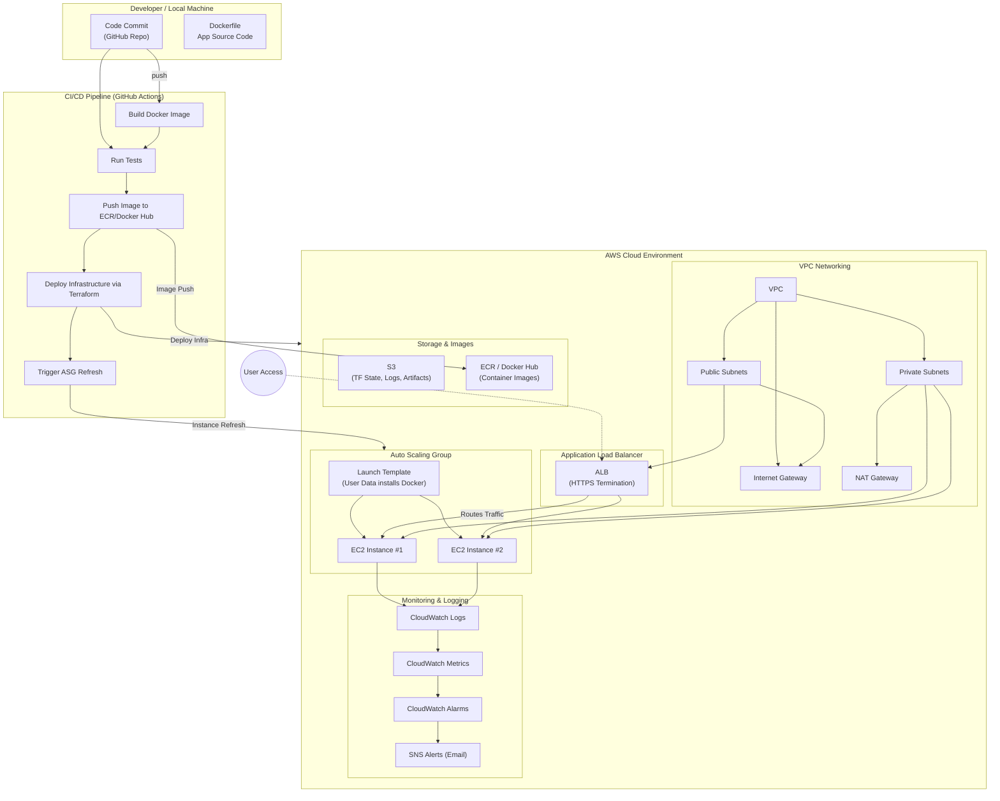

```mermaid
flowchart TD

  %% ========================
  %% GROUP: Developer Actions
  %% ========================
  subgraph DEV["Developer / Local Machine"]
    A1["Code Commit<br>(GitHub Repo)"]
    A2["Dockerfile<br>App Source Code"]
  end

  %% ========================
  %% GROUP: CI/CD PIPELINE
  %% ========================
  subgraph CICD["CI/CD Pipeline (GitHub Actions)"]
    B1["Build Docker Image"]
    B2["Run Tests"]
    B3["Push Image to ECR/Docker Hub"]
    B4["Deploy Infrastructure via Terraform"]
    B5["Trigger ASG Refresh"]
  end

  %% Developer to Pipeline
  A1 -->|push| B1
  A1 --> B2
  B1 --> B2 --> B3 --> B4 --> B5

  %% ========================
  %% GROUP: AWS Cloud Infrastructure
  %% ========================
  subgraph AWS["AWS Cloud Environment"]
    direction TB

    %% NETWORK
    subgraph NET["VPC Networking"]
      C1["VPC"]
      C2["Public Subnets"]
      C3["Private Subnets"]
      C4["Internet Gateway"]
      C5["NAT Gateway"]
      C1 --> C2
      C1 --> C3
      C1 --> C4
      C2 --> C4
      C3 --> C5
    end

    %% LOAD BALANCER + SSL
    subgraph LB["Application Load Balancer"]
      D1["ALB<br>(HTTPS Termination)"]
    end

    %% COMPUTE
    subgraph ASG["Auto Scaling Group"]
      E1["Launch Template<br>(User Data installs Docker)"]
      E2["EC2 Instance #1"]
      E3["EC2 Instance #2"]
    end
    E1 --> E2
    E1 --> E3

    %% CONNECTIONS BETWEEN COMPONENTS
    D1 -->|Routes Traffic| E2
    D1 --> E3
    C2 --> D1
    C3 --> E2
    C3 --> E3

    %% OBSERVABILITY
    subgraph OBS["Monitoring & Logging"]
      F1["CloudWatch Metrics"]
      F2["CloudWatch Logs"]
      F3["CloudWatch Alarms"]
      F4["SNS Alerts (Email)"]
    end
    E2 --> F2
    E3 --> F2
    F2 --> F1
    F1 --> F3 --> F4

    %% STORAGE + CODE
    subgraph STORAGE["Storage & Images"]
      G1["S3<br>(TF State, Logs, Artifacts)"]
      G2["ECR / Docker Hub<br>(Container Images)"]
    end

  end

  %% Pipeline to AWS
  B3 -->|Image Push| G2
  B4 -->|Deploy Infra| AWS
  B5 -->|Instance Refresh| ASG

  %% ALB exposed to internet
  ALB_OUTPUT(("User Access")) -.-> D1
```
